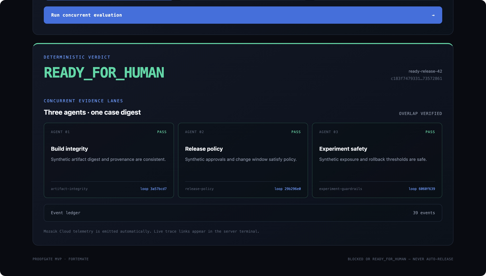
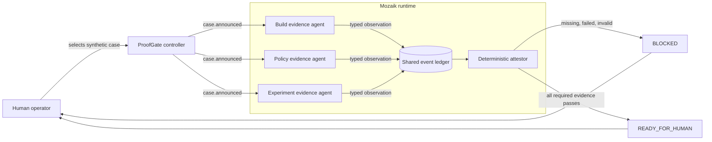
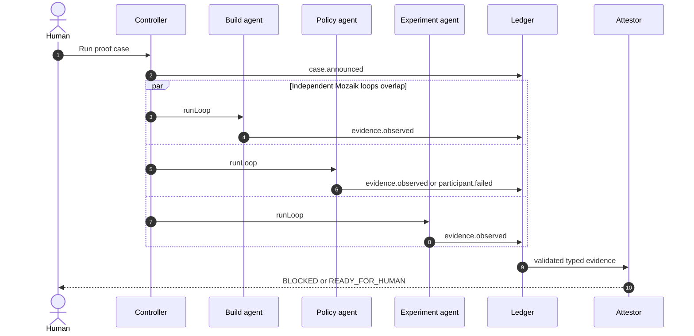
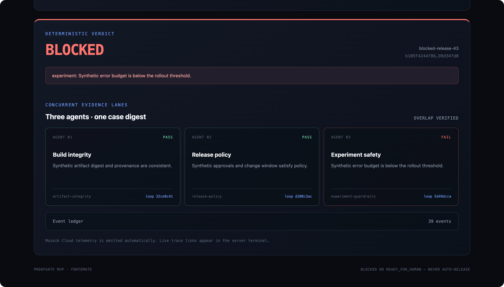
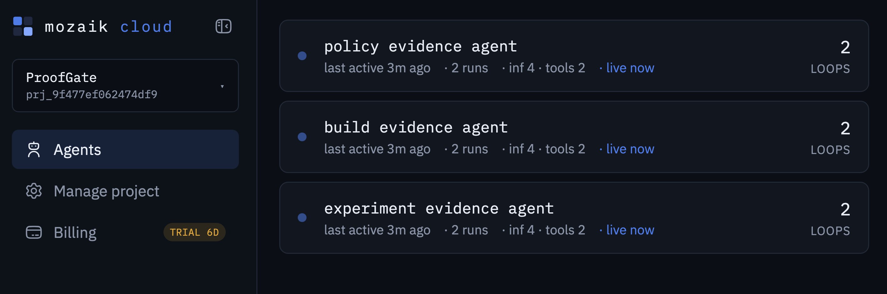
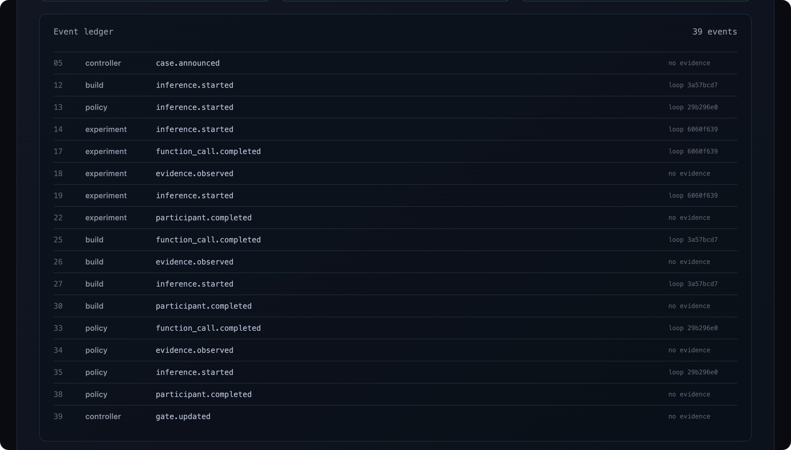
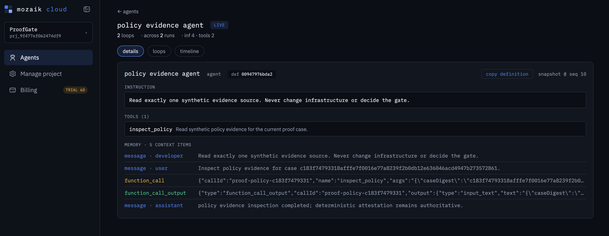
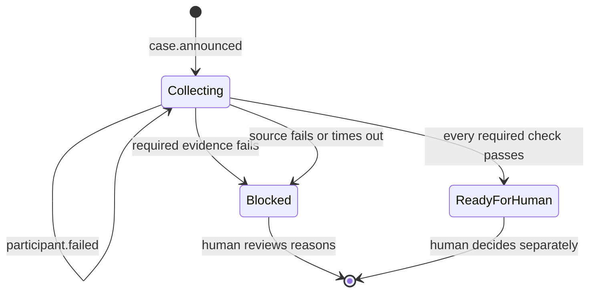

<div align="center">

# ProofGate

**Evidence before action.**

A read-only release and experiment control room built with concurrent
[Mozaik](https://github.com/jigjoy-ai/mozaik) agents.

[**Watch the 1:55 captioned demo**](https://youtu.be/THanAQS0FvY)

[](https://github.com/fortemate/proofgate/actions/workflows/ci.yml)


[](LICENSE)

</div>

ProofGate asks three independent agents to inspect **build integrity**,
**release policy**, and **experiment safety** at the same time. Their typed
observations enter a shared event ledger and a deterministic attestor returns
one of only two outcomes:

- `BLOCKED` — evidence is missing, invalid, unavailable, or explicitly failing.
- `READY_FOR_HUMAN` — every required check passed; a person still owns the
  release decision.

> [!IMPORTANT]
> ProofGate never deploys, rolls back, changes a flag, or writes to production.
> It prepares evidence for a human decision.

[](https://youtu.be/THanAQS0FvY)

<p align="center"><em>Select the screenshot to watch three independent evidence lanes produce one human-owned verdict.</em></p>

## Why concurrency is the point

This is not a sequential pipeline presented as a group of agents. Three
`createAgent` participants are created and joined first; a single
`case.announced` event then starts an independent Mozaik `runLoop` on each one.
Every loop reads its own evidence source and publishes events while the others
remain in flight.

ProofGate records every loop ID and reports `concurrencyObserved: true` only
when all three distinct loops started before the first inference completed.
A slow or failed participant remains visible and closes the gate instead of
silently disappearing.



## One evaluation, end to end



## Video walkthrough

The [1:55 captioned demo](https://youtu.be/THanAQS0FvY) shows all three
deterministic scenarios, the interleaved event ledger, concurrent Mozaik agent
traces, and the human-only decision boundary. The published English subtitle
track is also available as [`docs/demo-captions.srt`](docs/demo-captions.srt).

## Judge quick start

Requires Node.js 20 or newer.

```bash
git clone https://github.com/fortemate/proofgate.git
cd proofgate
npm ci
npm run check
npm run build
npm start
```

Open [http://127.0.0.1:4173](http://127.0.0.1:4173), choose a scenario, and
select **Run concurrent evaluation**.

For a terminal-only run:

```bash
npm run demo -- ready
npm run demo -- blocked
npm run demo -- failure
```

Add `--json` to inspect the redacted event timeline, evidence contract, case
digest, and three loop IDs:

```bash
npm run demo -- ready --json
```

## Demo scenarios

| Fixture   | What happens                            | Expected verdict  |
| --------- | --------------------------------------- | ----------------- |
| `ready`   | All three evidence checks pass          | `READY_FOR_HUMAN` |
| `blocked` | The experiment guardrail fails          | `BLOCKED`         |
| `failure` | The policy evidence tool is unavailable | `BLOCKED`         |

All scenarios are deterministic and synthetic. Running them needs no model API
key, production credential, registry access at runtime, or private Fortemate
data.

## Visual proof

| Fail closed on unsafe evidence                                                                                      | Observe all three agents in Mozaik Cloud                                                             |
| ------------------------------------------------------------------------------------------------------------------- | ---------------------------------------------------------------------------------------------------- |
|  |  |

<details>
<summary><strong>Inspect the event ledger and one agent trace</strong></summary>

The ledger preserves the interleaved lifecycle events and distinct loop IDs used
to verify overlap:



Mozaik Cloud exposes each agent's constrained instruction, tool, and synthetic
context for debugging:



</details>

## Trust model

The agent participants coordinate work, but they do not decide the gate. The
attestor reads validated tool output rather than natural-language answers.

Each observation contains its evidence role and the SHA-256 digest of the proof
case. Invalid JSON, an unexpected schema, the wrong digest, a failed check, a
tool error, missing evidence, or a timeout all produce `BLOCKED`.



## Project map

| Path                      | Responsibility                                                                              |
| ------------------------- | ------------------------------------------------------------------------------------------- |
| `src/domain.ts`           | Typed evidence contract, stable case digest, validation, and fail-closed attestation        |
| `src/proofgate.ts`        | Mozaik runtime, three agents, semantic events, event ledger, timeout, and concurrency proof |
| `src/inference-runner.ts` | Deterministic two-phase tool-call runner used by the credential-free demo                   |
| `src/fixtures.ts`         | Reproducible ready, blocked, and source-failure cases                                       |
| `src/server.ts`           | Localhost-only HTTP server and minimal JSON API                                             |
| `src/main.ts`             | Terminal demo and JSON output                                                               |
| `public/`                 | Visual Control Room and redacted event-ledger rendering                                     |
| `test/`                   | Verdict, failure, digest, concurrency, API, and browser-security tests                      |

## Mozaik Cloud observability

Pair the working copy once:

```bash
npx @mozaik-ai/cloud-sdk pair
```

With Mozaik 4.x, framework loop events are sent to the paired Cloud project
automatically. Run a scenario and open **Agents** in Mozaik Cloud to inspect the
three overlapping traces.

Pairing credentials remain outside the repository. Never commit a project key
or paste one into an issue, screenshot, or demo recording.

## Public-safe boundary

The repository contains only synthetic fixtures. It has no Fortemate production
URLs, private policies, model artifacts, tokens, deployment integrations, or
real operational thresholds.

A future connector must remain read-only, redact its source payload, and convert
it into the small evidence contract before the attestor sees it. Private
Fortemate adapters and policies belong outside this public hackathon repository.

## License

[MIT](LICENSE)
